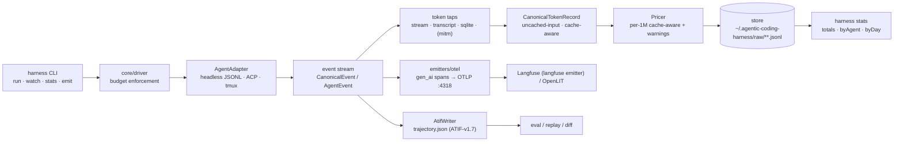

# agentic-coding-harness — Architecture

> **STATUS (2026-09-09):** written against the actual `src/` tree (`core/`, `adapters/`, `cli/`,
> `emitters/`, `monitors/`). Items that exist only by name are marked `[planned]` (the kiro
> adapter and its MITM tap shipped; see §2). The cross-file interface conflicts flagged ⚠ in
> earlier revisions are closed (§9); anything still diverging in `docs/TOKEN-COUNTING.md` keeps
> its flag — this doc describes the interfaces as they stand, not as they should be.

agentic-coding-harness is a headless-first orchestration and observability layer over coding-agent CLIs
(Claude Code, Codex CLI, OpenCode, Gemini CLI, Kiro). One harness, many agents: normalized events,
cache-aware token accounting, persisted trajectories, and live dashboards — without giving up each
agent's native strength.

## 1. Adapter pattern

The adapter contract lives in `src/adapters/types.ts`:

```ts
interface AgentAdapter {
  readonly id: string;
  readonly capabilities: AdapterCapabilities;   // headless · streaming · resume · acp · tmuxFallback
  spawn(prompt: string, opts?: RunOptions): RunHandle;
  resume(sessionId: string, prompt: string, opts?: RunOptions): RunHandle;
}
interface RunHandle {
  events: AsyncIterable<CanonicalEvent>;        // completes when the child exits
  wait(): Promise<number>;                      // child exit code
  abort(): void;                                // SIGTERM → SIGKILL after grace
}
```

`AgentCapabilities` makes the lane hierarchy explicit per CLI (`acp: true` on gemini today;
`tmuxFallback: true` on all shipped adapters).

Three driving lanes, in strict preference order:

1. **Headless-first (primary lane, implemented).** Every shipped adapter drives the CLI's
   non-interactive JSONL mode: `codex exec --json` (`adapters/codex.ts`), `gemini -p --output-format
   stream-json --approval-mode yolo` (`adapters/gemini.ts`), Claude `--output-format stream-json`
   (via the transcript tap until `adapters/claude.ts` lands). Lessons from running agents under
   Harbor apply: headless is the only lane that is reproducible, diffable, and parallelizable.
2. **ACP (emerging universal layer).** ACP-speaking agents collapse into one adapter — one event
   parser, one token tap. The capability flag tracks which CLIs are ready; new agent support
   checks ACP first.
3. **tmux fallback lane (implemented, `monitors/tmux-driver.ts`).** For TUI-only situations:
   `TmuxDriver` starts a detached session, sends the task with `send-keys -l` + a discrete Enter
   (the claude-squad mid-paste-submit lesson), captures the pane, and pipes raw output to a log.
   This lane is lossy — its token readout is the `TokenScraper` status-line approximation, never
   billing-grade.

All lanes converge on normalized events. The stream plumbing is shared: `adapters/shared.ts`
provides `runJsonlCli` (spawn → `LineAssembler` → `parseLine` → `EventQueue`), with an injectable
`SpawnFn` so tests replay recorded NDJSON fixtures through production plumbing. An optional
`onOutput` tap (RunOptions/RunSpec per-run, or DriverOptions.onOutput driver-wide, per-run wins)
receives each raw stdout chunk exactly as received — un-line-assembled — alongside the parsed
canonical events; it never fires for childless transports (kiro ACP, opencode preferServer).

### Canonical events

`CanonicalEvent` (`adapters/types.ts`) is what adapters emit:
`session | message(role,text,reasoning?) | tool(phase start|result, toolName, toolCallId, status?) | usage{tokens: CanonicalTokenRecord} | progress | error`.

`AgentEvent` (`core/types.ts`) is the core/domain event model the emitters consume:
`session_start | message{source,content,reasoningContent?} | model_call_start | model_call_end{usage?}
| tool_call{toolCallId,functionName,arguments} | tool_result{toolCallId,content,isError?} | usage{usage} | session_end`.
Both vocabularies are members of the single `AgentEvent` union in `core/types.ts` (the former
split is closed — see §9).

### Driver

`core/driver.ts` (`createDriver`) is the run orchestrator: resolves the adapter from a registry
(`defaultAdapters()` instantiates the bundled `adapters/{claude,opencode,kiro,codex,gemini}.js`
classes, skipping missing ones with a warning), attaches to the event stream, writes a raw NDJSON
transcript to `<stateDir>/raw/<agent>-<sessionId>.jsonl`, normalizes usage (`normalizeAuto` /
`fromPreNormalized`), prices each record via the `Pricer`, and enforces budgets inside the event
loop. All four `budget` fields of `RunSpec`: `budget.usd` aborts with `exitStatus:
"budget_exceeded"` once cumulative cost passes it (checked per usage event); `budget.maxTurns`
aborts with `"turn_limit"` on the crossing step, only when the adapter doesn't enforce it itself
(`adapter.enforcesBudget`); `budget.wallMs` and `budget.idleMs` abort with `"timeout"` when total
run time — or the gap since the last event — exceeds the ceiling. Driver enforcement verdicts
override the adapter's own exit verdict.

### Run registry

`core/registry.ts` keeps one JSON file per run at `<stateDir>/runs/<runId>.json`
(driver-generated uuid): identity (`agent`, `sessionId` once reported, `pid`, `cwd`,
`promptPreview`), lifecycle (`status`, `exitStatus`, `startedAt`/`updatedAt` heartbeat), running
totals (token classes + `costUsd`, kiro `credits` kept separate), a one-line `lastEvent` preview,
and the `rawTranscript` path. Writes are atomic — temp file (`*.tmp-<pid>`) + rename, synchronous,
safe on hot event paths; the driver heartbeats totals/lastEvent throttled to one write per ≥500ms
and forces the final write at exit. `isLive` requires all three: `status === "running"`, a
heartbeat ≤15s fresh, and a pid that answers `kill(pid, 0)`. Failure isolation is by design:
readers skip corrupt/partial files (never throw), and registry write failures drain into run
warnings — a broken registry never breaks a run. Records carry additive provenance fields so an
external run can be distinguished from a local one: `experiment`, `variant`, `workflow`,
`source` (`"local"` by default, `"external"` for feed-sourced records), `producer`, `endedAt`,
and free-form `metadata`.

### Dash and MCP consumers

`cli/dash.ts` (`harness dash`) is the registry's live reader: `listRunRecords` + `isLive` feed an
ANSI full-screen table redrawn every 500ms — live runs plus finished runs from the last hour;
`--all` widens to every record on disk (dash prunes display, never files). Non-TTY stdout falls
back to a `--json` dump (records plus a `live` flag) for tools and tests. The MCP stdio server
(`mcp/index.ts`, protocol 2025-06-18) works the driver seam instead: `harness_run` builds
`createDriver` + `defaultAdapters()` per call (`mcp/tools-run.ts`), `harness_agents` lists the
adapter registry, and `harness_report`/`harness_emit`/`harness_stats` expose the CLI's inspect
path over the same `stateDir` (`mcp/tools-inspect.ts`); `ach mcp` is the CLI
entry point into this stdio lane (`mcp/index.ts` remains the library entry,
wired into the dispatcher by `src/cli/mcp.ts`); client config lives in
`docs/MCP.md`.

### Run sources (the `RunSource` seam)

The web dashboard's run hub no longer talks to the filesystem directly — it sits behind the
`RunSource` interface (`web/run-source.ts`: `start(onChange)` / `snapshot()` / `stop()` plus an
optional `health()`), so the hub is agnostic to where records come from. Three implementations
ship:

- **`FsRunSource`** — the historical behavior lifted verbatim: `listRunRecords` snapshot plus a
  debounced `fs.watch` on `<stateDir>/runs` (default when no `--source` is configured).
- **`HttpRunSource`** (`web/run-source-http.ts`) — watches a remote feed: `GET {url}/runs`
  returns `{ records: RunRecord[] }` for polling (default, 3s interval); SSE at `{url}/runs/stream`
  (`event: runs`, `data: {"records":[...]}`) or WebSocket at `{url}/runs/ws`
  (`{"type":"runs","records":[...]}`) give live pushes. Records are validated against
  `RunRecordSchema` (`core/external-source.ts` `ExternalRunFeedSchema` wraps the `{records}`
  envelope); invalid records are dropped with a counted warning, and connection failures flip the
  source unhealthy without throwing. A `--source-token` rides along as a bearer header.
- **`MergedRunSource`** (`web/run-source-merged.ts`) — the union of several sources, merged in
  constructor order so a `runId` seen by multiple sources resolves to the last one (the external
  feed wins over the local registry); `--source-merge state` composes it, while the default
  `only` serves the external feed alone. Health is the AND of the children.

The dashboard surfaces source state at `GET /health` (`source`, `sourceHealthy`). The same
records power the compare path: `web/compare.ts` rolls `hub.snapshotRuns()` into groups
(`experiment`×`variant` or `workflow`×`agent`) exposed as `GET /api/compare?by=…` (rows carry
`runs`, `avgTotalTokens`, `avgCostUsd`, `avgDurationMs`, `successRate`) and rendered by the
`GET /compare` view. PTY attach stays local-only — `POST /api/pty` and `/ws/pty/*` reject
external runs with `409` because no local process exists to attach to.

## 2. Token taps

Usage exists in different places per agent; four collection points all feed the same normalizers
(`core/normalize.ts` exposes `normalizeUsage(agent, raw)` — per-agent extractors, null on
mismatch, never fabricated zeros):

| Tap | Reads today | Where |
|---|---|---|
| Headless stream parsing | native JSONL lines mapped by each adapter's `parse*Line`; usage payloads re-normalized by `core/normalize.ts` (`normalizeClaude`, `normalizeOpencode`, `normalizeCodex`, `normalizeGemini`, `normalizeKiro`) | `src/adapters/*.ts`, `src/core/normalize.ts` |
| Transcript files | Claude Code transcripts tailed byte-exactly by offset (`cli/lib.ts extractClaudeRecordFromLine`; `cli/ach.ts watch` grows-only over `~/.claude/projects/**/*.jsonl`) | `src/cli/lib.ts` |
| Agent SQLite | opencode's local store via `statsFromDb` (stub: schema probe returns `[]` until the real mapping lands; `bun:sqlite` readonly) | `src/adapters/opencode.ts` |
| kiro MITM | `KiroAdapter.launch()` auto-starts `mitmdump` with the inline EventStream addon (default: on when `mitmdump` is on PATH — probe cached; explicit `mitm` option overrides), binds the first free port in 8900-8999, routes kiro-cli through `HTTPS_PROXY`/`SSL_CERT_FILE` (`tapEnv`), and interleaves the tap's records with stdout events; metering credits land in `extra.credits` (metering units, **not USD** — never priced), token counts stay on the stdout usage events (tap events carry zeros). Parser handles both the pre-2.10 `tokenUsage` wire shape and the 2.21 AWS EventStream frames. Degrades gracefully (stderr warning, untapped run) when `mitmdump` is missing or no port binds | `src/monitors/kiro-mitm.ts`, `src/adapters/kiro.ts` |
| LiteLLM proxy `[planned]` | model-agnostic spend ledger for calls routed through it | — |

Rule: **tap one layer per run.** Others are reconciliation sources, never additive
(`docs/TOKEN-COUNTING.md` §2 for the double-counting traps). The kiro MITM tap is
the exception that proves the rule safe: its events carry zero token counts, so the
stdout usage events remain the single token source — the tap adds only the credits
dimension (`extra.credits`, summed by `harness run` into the `credits` summary line).

## 3. Canonical token record

The canonical shape is `CanonicalTokenRecord` — cache-aware, with the uncached-input convention.
The two historical variants are merged (2026-09-10): `core/types.ts` hosts the single record —
`{agent?, model?, timestamp?, inputTokens, outputTokens, cacheReadTokens, cacheWriteTokens,
reasoningTokens?, costUsd?, extra?}` — **`inputTokens` is uncached-only by convention**;
codex/gemini entries are adjusted at extraction time (`input − cached`). The legacy aliases
(`promptTokens`/`completionTokens`/`cachedTokens`) survive as optional fields read defensively by
the driver, store, and emitters (`fromLegacy()` converts legacy producers); `adapters/types.ts`
re-exports the same record for the CLI adapters.

`sumTokens()` sums each class exactly once; `reasoningTokens` is informational (a subset of
output for providers that bill it inside output). No stored grand total: dashboards derive
`input + cacheRead + cacheWrite + output`, because the correct derivation is provider-dependent.

Cost: `core/pricing.ts` — cache-aware per-1M pricing with an embedded fallback table
(claude-sonnet-4/opus-4, gpt-5, gemini-2.5-pro), LiteLLM-style external map loading (accepts
per-1M or per-token fields), and `resolveAlias` (strips provider prefixes, date stamps,
`-latest/-preview`). Unknown model → `NaN` + a drained warning, **never a silent 0** (sole
exception: credit-metered kiro records with no model — silent 0 by design,
`docs/TOKEN-COUNTING.md` §3). The CLI's transcript tap prices rows without their own `costUSD`
through the same `Pricer` (the old `cli/lib.ts estimateCostUsd` prefix table is gone).

## 4. ATIF as persisted artifact

`emitters/atif.ts` implements the ATIF trajectory (`ATIF-v1.7`) as a writer:

- `AtifWriter.startTrajectory({agent, version, modelName})` → `addStep(...)` → `finalize(path)`
  writes `trajectory.json`; `toTrajectory()` returns the document.
- `AtifWriter.fromEvents(events, opts)` converts a harness event stream: `message` events become
  steps, `tool_call`/`tool_result` become step `tool_calls` + `observation.results` (joined by
  `tool_call_id`), `usage`/`model_call_end` accumulate into step `metrics` and `final_metrics`.
- `AtifWriter.validate(path)` checks structural invariants: `step_id` ordering and that every
  observation result references a known `tool_call_id`.
- `addSubagent()` nests child trajectories under `extra.subagents`.

The CLI also exposes `harness emit --input events.json --format atif|otel|langfuse [--out path]`,
routing straight through the real emitters (the `core/emitters.ts` envelope stub is deleted). ATIF
is the durable per-run artifact for eval, replay, and diff.

## 5. OTel gen_ai spans as live transport

`emitters/otel.ts` maps a run to OpenTelemetry spans using `gen_ai.*` semantic conventions:

- Root span `invoke_agent <agent>` with `gen_ai.agent.name`, `gen_ai.conversation.id`,
  `gen_ai.request.model`.
- Child `chat <model>` spans per usage event with `gen_ai.usage.input_tokens`,
  `gen_ai.usage.output_tokens`, `gen_ai.usage.cache_read.input_tokens`
  (`cachedTokens + cacheReadTokens`), `gen_ai.usage.cache_write.input_tokens`,
  `gen_ai.usage.reasoning.output_tokens`.
- Child `execute_tool <fn>` spans from `tool_call` → matching `tool_result` timestamps.

Two paths: `deriveSpans`/`toOtlpJson` are pure (testable, proto-JSON shape); `emitRun` exports
through a real tracer, and `createTracer` wires a `NodeTracerProvider` +
`BatchSpanProcessor(OTLPTraceExporter)` at `http://localhost:4318/v1/traces` by default. Spans
are fire-and-forget live transport — the SQLite ledger and ATIF file remain the source of truth.

## 6. State detection manifests

`monitors/tmux-driver.ts` classifies pane text with declarative rule manifests — data, not code:

```ts
type AgentState = 'running' | 'waiting' | 'idle';
interface DetectionRule {
  state: AgentState;
  pattern: RegExp;              // no /g flag — rules re-test every poll
  region?: 'bottom' | 'anywhere';
  priority: number;             // higher wins; ties → earlier-listed rule
}
```

`StateDetector.detect(paneText)` scores all rules over the bottom region (last 4 non-empty lines)
or the whole pane, first-priority wins, no match → `idle`. Shipped manifests: `CLAUDE_RULES`
(permission box outranks "esc to interrupt" because a mid-run prompt can still show it),
`OPENCODE_RULES`, and a deliberately broad `KIRO_RULES` to refine from `pipeTo` logs.
`watchLoop` polls (2s default), dedupes consecutive identical states, and fires `onChange` on
transitions; the `TokenScraper` sums the TUI's `↓/↑ … tokens` readouts as an approximate,
explicitly not billing-grade figure.

## 7. Sinks and storage

- **ATIF file** — durable per-run artifact (§4).
- **OTel spans** — live OTLP transport (§5); any OTLP endpoint works as a sink, e.g. an OpenLIT
  collector `[planned wiring]`.
- **Langfuse** — verified live sink (`emitters/langfuse.ts`). `emitToLangfuse()` reuses the §5
  `toOtlpJson()` gen_ai payload, layers the `langfuse.*` namespace on top, and POSTs OTLP/HTTP
  JSON to `{baseUrl}/api/public/otel/v1/traces` with Basic auth (pk:sk) and
  `x-langfuse-ingestion-version: 4` (real-time ingest onto the v4 data model). Mapping: every
  span carries `langfuse.session.id`; the root `invoke_agent` span becomes a `span`-typed
  observation + trace name; chat spans become `generation` observations with
  `langfuse.observation.model.name` (usage record's model, falling back to `--model`) and
  `langfuse.observation.usage_details` — Langfuse's mutually-exclusive bucket contract
  (`input` EXCLUDES cache slices; `cacheReadTokens` → `cache_read_input_tokens`,
  `cacheWriteTokens` → `cache_creation_input_tokens`; `total` is derived server-side as the
  bucket sum); `langfuse.observation.cost_details` `{total: costUsd}` when the record carries
  cost; tool spans stay `span`-typed with the tool name in `gen_ai.tool.name`. CLI:
  `harness emit --format langfuse --input <events.json> --langfuse-url/--langfuse-public-key/
  --langfuse-secret-key` (env fallbacks `LANGFUSE_URL`/`LANGFUSE_HOST`, `LANGFUSE_PUBLIC_KEY`,
  `LANGFUSE_SECRET_KEY`). Verified live against a local Langfuse v4 docker-compose instance
  (v4.33.0): OTLP ingest (HTTP 200), then read-back of trace + observations — root SPAN and
  child GENERATION with the exclusive usage buckets — via `GET /api/public/v2/observations`
  (the legacy `GET /api/public/traces` list endpoint is disabled on v4 events-only deployments)
  and the v4 events store itself.
- **State store** (`core/store.ts`, JSONL not SQLite): root at `~/.agentic-coding-harness`
  (`AGENTIC_CODING_HARNESS_STATE_DIR` overrides). Canonical records append to `<stateDir>/raw/<agent>/<sessionId>.jsonl`;
  `harness watch` keeps byte offsets in `offsets.json` so restarts resume without replay;
  `readAllRecords` powers `harness stats` (`aggregate()` → totals/byAgent/byDay buckets).

## 8. Data flow



CLI → driver → adapter → events; events fan out to the ATIF file, OTel spans, and the normalized,
priced token record in the JSONL state store; dashboards and `stats` read the sinks or the store.

## 9. Interface merges (resolved)

The cross-file conflicts flagged ⚠ in earlier revisions of this doc are closed as of 2026-09-10;
`core/types.ts` is the single source of truth and `adapters/types.ts` re-exports from it:

- dual `AgentEvent` vocabularies → one union of all lanes' events (driver `step`/`usage`/
  `usage_raw`, transcript `message`/`tool_call`/`tool_result`/`model_call_*`/`session_*`,
  adapter `tool`/`session`/`progress`).
- dual `CanonicalTokenRecord` shapes → one record: normalize.ts semantics plus optional legacy
  aliases, with `fromLegacy()` for legacy producers.
- dual emitter trees → the `core/emitters.ts` envelope stub is deleted; the CLI routes straight
  to `emitters/{atif,otel,langfuse}.ts`.
- driver `launch`-style vs adapter `spawn`-style contract → all five adapters implement
  `launch()` natively (bridged via `launchDriverHandle`, `adapters/shared.ts`).
- `cli/ach.ts` imports → `core/types.ts` exports `AGENTS`/`isKnownAgent`/`RunResult`/
  `HarnessError`, and the CLI transcript fallback prices through `core/pricing.ts`.
